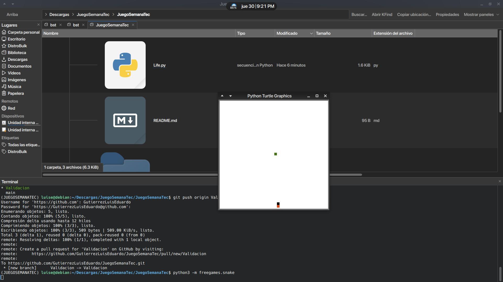
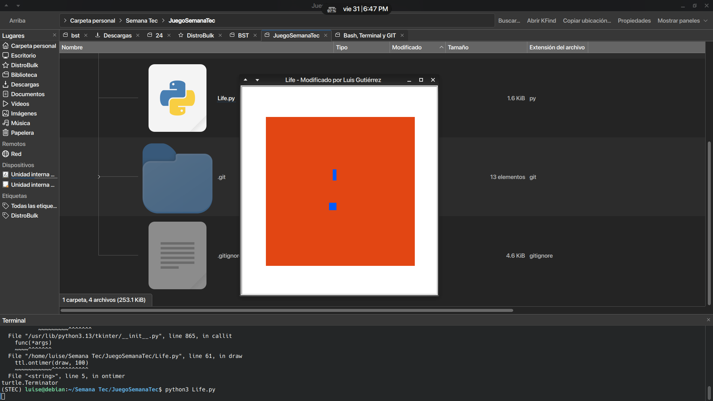

# JuegoSemanaTec
Repositorio para la Actividad 4. "Instalación de software desde la terminal"

## Imagen del juego

 El juego siendo probado tras las CORRECCIONES que adecuaron el código conforme a los lineamientos de PEP8 

El juego siendo probado tras las MODIFICACIONES ESTÉTICAS Y DEL TÍTULO DE LA VENTANA, HECHAS POR MÍ, LUIS GUTIÉRREZ